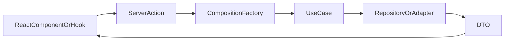
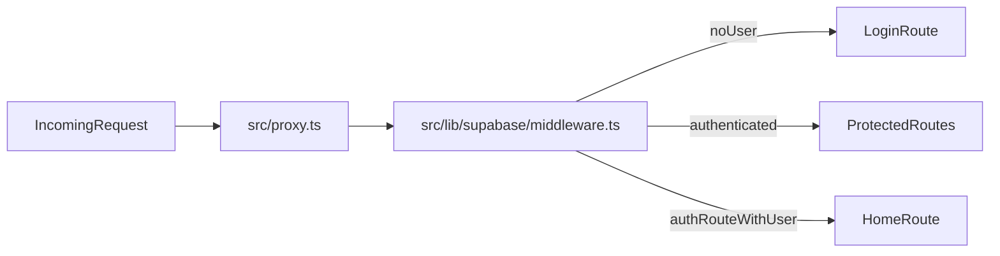
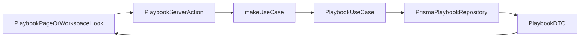
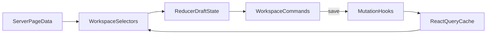

# PeerPlaybook Architecture

This document explains the current runtime boundaries in PeerPlaybook. It is intentionally current-state focused so a new collaborator can understand how the app works today, even while migration work is still in progress.

## Product Model

PeerPlaybook helps SI leaders build structured study-session plans.

Core concepts:

- `playbooks`: the plan container
- `playbook_phases`: ordered sections within a playbook
- `playbook_strategies`: strategy instances attached to a playbook or phase
- `sessions`: scheduled or live session records
- `profiles`: collaborator and facilitator profile records

The user-facing playbook model is moving toward:

```text
Playbook -> Playbook Phases -> Strategies
```

The repository still carries compatibility logic for the older strategy phase model:

```text
warmup -> workout -> closer
```

That compatibility layer exists because some stored strategies and UI flows still depend on legacy phase values.

## High-Level Runtime Flow

Most migrated features follow this path:



This pattern keeps:

- validation and auth checks near the server action boundary
- orchestration in use cases
- persistence details in repositories
- view shaping in DTOs and selectors

## Directory Responsibilities

```text
src/app/           Routes, layouts, route handlers, and page composition
src/actions/       Server actions used by the UI
src/composition/   Dependency wiring for use cases and repositories
src/features/      Feature slices
src/components/    Shared providers and reusable UI
src/lib/           Shared infrastructure, clients, validation, and query helpers
src/shared/        Shared result types, action helpers, and error utilities
```

Within a feature slice, the target structure is:

```text
domain/            Stable business language and repository contracts
application/       Use cases, DTOs, assemblers, application services
infrastructure/    Prisma repositories, adapters, static catalogs, mappers
presentation/      Hooks, selectors, and feature UI
```

## Prisma And Supabase Split

The repository currently uses both Prisma and Supabase for different responsibilities.

### Prisma owns

- most migrated playbook reads and writes
- profile and session repository work on the newer path
- transactional writes that coordinate playbooks, phases, and strategies
- server-side PostgreSQL access through `src/lib/db/client.ts`

### Supabase owns

- authentication
- SSR cookie/session refresh
- storage concerns such as avatar buckets
- some older repository and client-side integration paths

### Practical rule

Before changing a flow, confirm which boundary it uses today. Do not assume that a feature using Supabase auth must also use Supabase table access, or that a Prisma-backed server action no longer depends on Supabase for the current user.

## Authentication And Request Gating

Auth is handled with Supabase SSR helpers and a request-level guard.



Important details:

- the request guard refreshes session cookies
- unauthenticated users are redirected to `login`
- authenticated users are redirected away from `login` and `sign-up`
- server components may not always be able to persist cookie writes directly, so middleware remains part of the session contract

## App Bootstrap

`src/app/layout.tsx` warms initial query state for authenticated requests.

Today that prefetch step primarily loads:

- the signed-in user's profile detail
- the signed-in user's playbook list

This allows the hydrated client to render without paying the full cost of a second fetch on first paint.

## Playbook Data Flow

The playbook feature is the clearest example of the current architecture.



Examples:

- create flow: create playbook -> create phases -> copy strategy records into playbook strategy rows
- update flow: validate ownership -> persist mutations -> invalidate or patch query caches
- generate flow: assemble AI prompt -> validate structured output -> persist through the same create path

## Phase Intent Compatibility Model

The app currently bridges two related but different concepts:

- `phase_intents.key`: `activate`, `explore`, `apply`, `reflect`
- `playbook_strategies.phase`: `warmup`, `workout`, `closer`

Why this matters:

- UI editing prefers the newer intent model
- some persisted strategy rows still carry the legacy phase value
- selectors and optimistic updates often need to understand both

When a playbook strategy already has `playbookPhaseId`, the app can group strategies by the true phase relationship. If that ID is missing on older rows, selectors fall back to the legacy phase string.

## Workspace Editing Lifecycle

The playbook detail workspace uses a draft-first model rather than persisting every keystroke directly.



Important behaviors:

- phase edits are local until the user saves
- phase reordering is local until save recomputes positions
- adding a phase persists immediately, then later reorder/save can change final positions
- strategy edits keep a draft snapshot and compare against a baseline to determine dirty state
- optimistic cache helpers patch the playbook page cache before the server confirms the mutation

## React Query Cache Boundaries

Playbook data is intentionally cached in multiple shapes.

Important keys include:

- `playbookKeys.detail(id, "base")`
- `playbookKeys.detail(id, "detail")`
- `playbookKeys.page(id)`
- `playbookKeys.byUserId(userId)`

This matters because:

- the same playbook can exist in multiple cached representations
- optimistic updates often need to patch more than one key
- rolling back a failed mutation means restoring each affected shape

If you add a mutation, make sure you know which cache shapes it can invalidate or update.

## AI Generation Boundary

AI-assisted playbook generation lives under `src/features/ai`.

Current flow:

1. filter candidate strategies by request context
2. build a structured prompt
3. ask the model for JSON only
4. validate the result with Zod
5. reject duplicate, missing, or unknown strategies
6. persist the accepted plan through the normal playbook create path

The planner still works with the legacy `warmup/workout/closer` shape, so this area remains an important migration boundary.

## Sessions And Stream Video

Session data and Stream integration are related but separate concerns.

- session records represent scheduled activity in the app
- Stream token and profile helpers prepare video identity for live experiences
- some UI currently uses placeholders or static affordances while the session feature continues to mature

When touching this area, verify whether you are changing app persistence, external video identity, or both.

## Known Migration Constraints

The repository is not fully converged yet. Expect to see:

- Prisma and Supabase code paths living side by side
- server actions and API routes both present during migration
- legacy phase strings coexisting with phase-intent keys
- UI placeholders that are intentionally static until a feature slice is completed

Treat these as explicit compatibility boundaries, not accidental duplication.

## Related Documents

- `README.md`
- `CONTRIBUTING.md`
- `docs/MIGRATION_AUDIT.md`
- `docs/PLAYBOOK_CHECKLIST.md`
